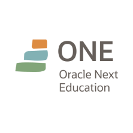

  

### What is Oracle Next Education?

ONE is an education and employability program with the social objective of training people in technology and connecting them with the job market through partner companies.

The course is 100% online and completely free

This training is part of the ONE program, a partnership between Alura + Oracle

Find out more at https://www.oracle.com/br/education/oracle-next-education/

### Training: T7 Programming Beginner - ONE

The stone's throw to enter the world of programming and start creating websites using the popular CSS, HTML and JavaScript languages.

### Get to know this training!

If you don't know anything about programming and software development, but want to get into this area where the job market is overheating, the Beginner Programming course is for you!

You'll create your first web pages using HTML, CSS, JS and learn programming logic along with the most widely used programming languages in the world.

If you work in other areas such as digital marketing, user experience (UX), design, or related areas, this training will help you better understand how the technology area works and so you can communicate better with the development area.

- 72h
- 9 courses
- 2 extra videos
- 7 articles

### Step by step

1. How to use the forum

- The forum is a special and incredible place where we can ask questions related to the courses, so it's important that before you start studying, you understand how to use the forum on our platform.
- We prioritize using the forum only for questions. If you don't have any, you can use it to help others, strengthening our Alura community.

2. Study plan

- The study plan has been created to guide you on this new learning path. In it you will find the suggested order in which you should take the courses and the proposed time in which you should complete the modules. With it you can follow the rhythm of the ONE program and make the most of your study time.

3. Learn programming logic

- Logical thinking is with us all the time. For example, to make coffee, we first need to heat the water, then pour the hot water over the coffee powder, so that the powder is strained and the coffee is ready to drink. If you don't follow this logical sequence, it will be difficult to enjoy a good cup of coffee.
- Programming logic is nothing more than a sequence of steps to solve a problem. In this case, the computer will solve the problem based on the instructions we give it. So we need to know what kind of instructions the computer understands and how best to pass commands to communicate with it.

4. Master the art of creating prompts in ChatGPT

- Unlock the secrets of creating effective prompts in ChatGPT and explore the full potential of this incredible tool! Learn how to use different strategies, from the most basic to the most advanced, to get reliable results and maximize your goals.
- Get ready to dive into the fascinating world of OpenAI Playground, an interactive environment where you can put your knowledge into practice and try out new possibilities with ChatGPT.

5. Create your first web pages

- Wow, that was a deep dive! We learned a lot about how code is interpreted and executed by the computer. Now that we've learned all that, let's learn the last piece we need to create a web page.
- We're going to use HTML and CSS and create layouts for a static web page. We're not going to work with interactivity on our page yet. But don't worry, the next step is to put everything we've learned together in a new web project.

6. Gain experience with Git

- It's very important to prepare yourself to work as part of a team in development, after all, nobody works alone. So let's learn about the world's most widely used code versioning system, Github, which allows us to share code with other people in a simple and secure way.
- Good teamwork depends on having a code version control system so that we can recover, revise and improve more and more. Knowing a version control system like Git is essential for maintaining the quality and productivity of your work.

7. Take the Beginner's Programming Challenge

- It's a way of implementing Challenge Based Learning, which Apple helped to create. Challenge Text Decoder is a key to success as a developer. Through practice and improved logic, you will strengthen your knowledge, master logical thinking, improve analysis and problem solving, and expand your view of the development world.
